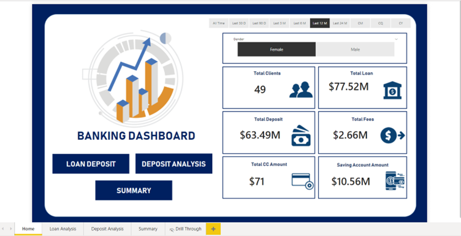
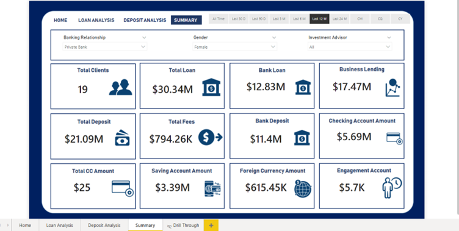

# 🏦 Banking Domain Data Analytics – Customer & Transaction Insights

_Analyzing customer behavior, product performance, and transaction trends to improve decision-making in banking using SQL, Python, and Power BI._

---

## 📌 Table of Contents
- <a href="#overview">Overview</a>
- <a href="#business-problem">Business Problem</a>
- <a href="#dataset">Dataset</a>
- <a href="#tools--technologies">Tools & Technologies</a>
- <a href="#project-structure">Project Structure</a>
- <a href="#data-cleaning--preparation">Data Cleaning & Preparation</a>
- <a href="#exploratory-data-analysis-eda">Exploratory Data Analysis (EDA)</a>
- <a href="#research-questions--key-findings">Research Questions & Key Findings</a>
- <a href="#dashboard">Dashboard</a>
- <a href="#how-to-run-this-project">How to Run This Project</a>
- <a href="#final-recommendations">Final Recommendations</a>
- <a href="#author--contact">Author & Contact</a>

---
<h2><a class="anchor" id="overview"></a>Overview</h2>

This project analyzes banking data to uncover customer transaction patterns, product performance, and risk factors. The goal is to support data-driven decisions in customer retention, loan risk assessment, and product strategy. A complete pipeline was built using SQL for data extraction, Python for EDA, and Power BI for dashboard creation.

---
<h2><a class="anchor" id="business-problem"></a>Business Problem</h2>

Banks face challenges in customer churn, fraud detection, and identifying revenue opportunities. This project aims to:
- Understand customer demographics and transaction behavior
- Identify top-performing and underperforming products
- Detect dormant accounts and churn risk early
- Flag potential fraudulent activity
- Enable business leaders to track KPIs in real-time

---
<h2><a class="anchor" id="dataset"></a>Dataset</h2>

- Transaction records (date, amount, type)
- Customer demographics (age, gender, income)
- Product-level data (loans, deposits, credit cards)

---

<h2><a class="anchor" id="tools--technologies"></a>Tools & Technologies</h2>

- **SQL** (ETL, Joins, Aggregations)
- **Python** (Pandas, Matplotlib, Seaborn)
- **Power BI** (KPI Dashboard)
- **Excel** (Initial data validation)

---
<h2><a class="anchor" id="project-structure"></a>Project Structure</h2>

```
banking-analytics/
│
├── README.md
├── Banking_Project_Report.pdf
│
├── notebooks/
│ ├── exploratory_data_analysis.ipynb
│
├── scripts/
│ ├── data_ingestion.py
│
├── dashboard/
│ └── banking_domain_dashboard.pbix
```

---
<h2><a class="anchor" id="data-cleaning--preparation"></a>Data Cleaning & Preparation</h2>

- Removed duplicate and cancelled transactions
- Imputed missing customer demographics
- Standardized date formats for time-series analysis
- Filtered out zero-transaction dormant accounts for certain KPIs

---
<h2><a class="anchor" id="exploratory-data-analysis-eda"></a>Exploratory Data Analysis (EDA)</h2>

**Key Observations:**
- Majority customers in 25–40 age group (working professionals)
- Transactions peak during salary credit dates and festive months
- ~6% loan default rate (moderate risk)
- Dormant customers identified with zero activity for 6+ months

**Correlation Insights:**
- Strong correlation between number of products and revenue
- Negative correlation between tenure and churn probability
- Weak positive relation between loan size and default probability

---
<h2><a class="anchor" id="research-questions--key-findings"></a>Research Questions & Key Findings</h2>

1. **Revenue Drivers**: 60% of deposits & loans from 25–40 age group  
2. **Product Gaps**: Credit card adoption low despite profitability → needs marketing focus  
3. **Seasonality**: Higher spend Oct–Dec → good time for campaigns  
4. **Churn Indicators**: Declining activity 3–6 months before churn → targeted retention possible  
5. **Fraud Alerts**: Detected unusual high-value transaction spikes  

---
<h2><a class="anchor" id="dashboard"></a>Dashboard</h2>

- Power BI dashboard visualizes:
  - Revenue by product & segment
  - Churn risk heatmap
  - Loan default trends
  - Monthly transaction patterns




---
<h2><a class="anchor" id="how-to-run-this-project"></a>How to Run This Project</h2>

1. Clone the repository:
```bash
git clone https://github.com/yourusername/banking-analytics.git
```
3. Load the CSVs and ingest into database:
```bash
python scripts/ingestion_db.py
```
4. Open and run notebooks:
   - `notebooks/Bank_EDA_Analysis.ipynb`

6. Open Power BI Dashboard:
   - `dashboard/Banking Dashboard.pbix`

---
<h2><a class="anchor" id="final-recommendations"></a>Final Recommendations</h2>

- Launch targeted campaigns to boost product adoption
- Implement churn prediction model for proactive retention
- Improve fraud detection via anomaly detection models
- Incentivize digital adoption to move closer to 80% online transactions

---
<h2><a class="anchor" id="author--contact"></a>Author & Contact</h2>

**Vaibhav Gupta**  
Data Analyst  
📧 Email: vaibhav.gupta.career@gmail.com
🔗 [LinkedIn](https://www.linkedin.com/in/guptavaibhav01/)
